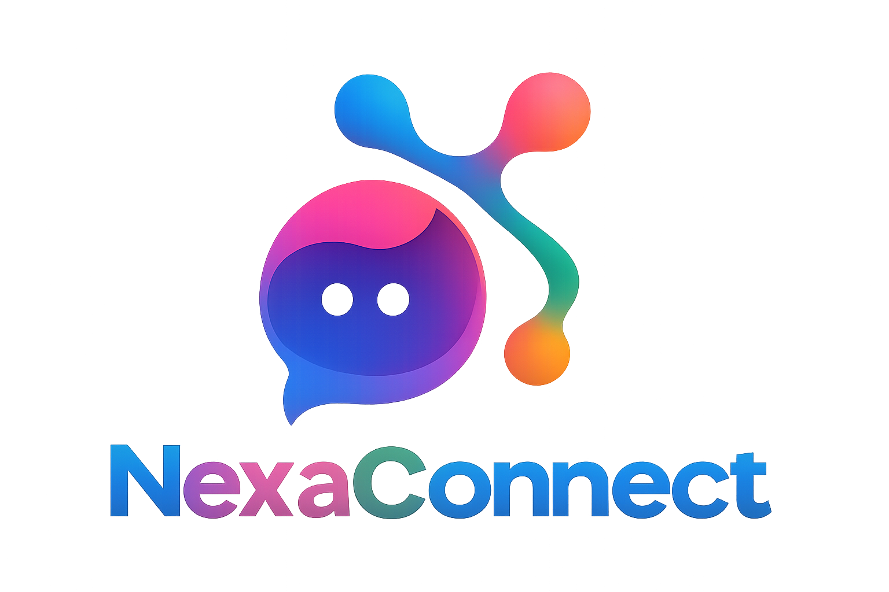
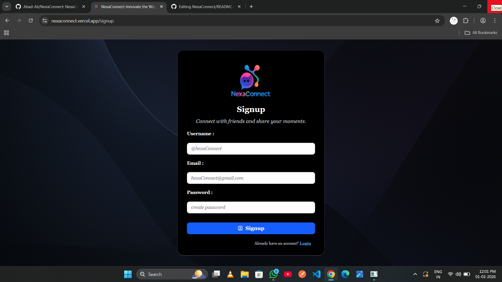
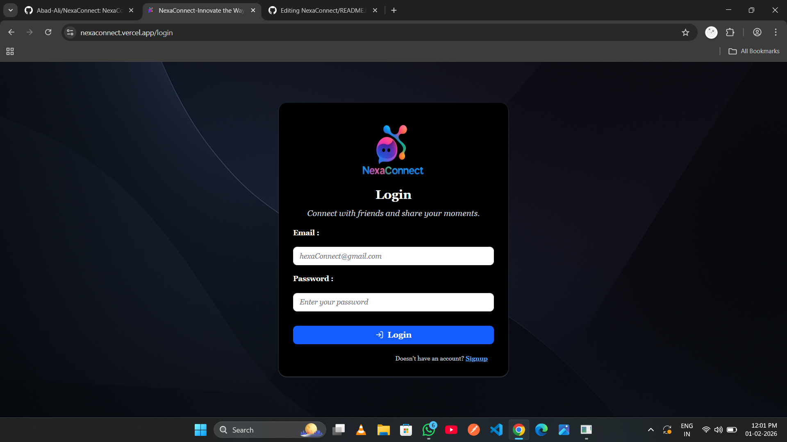
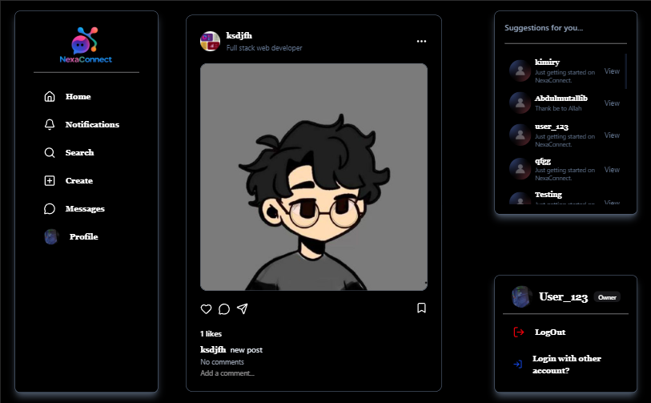
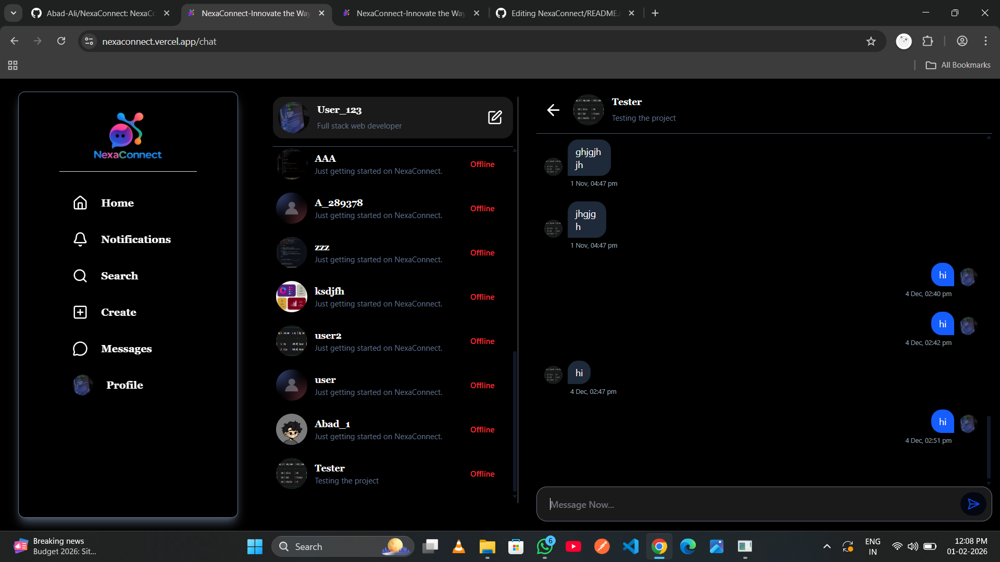
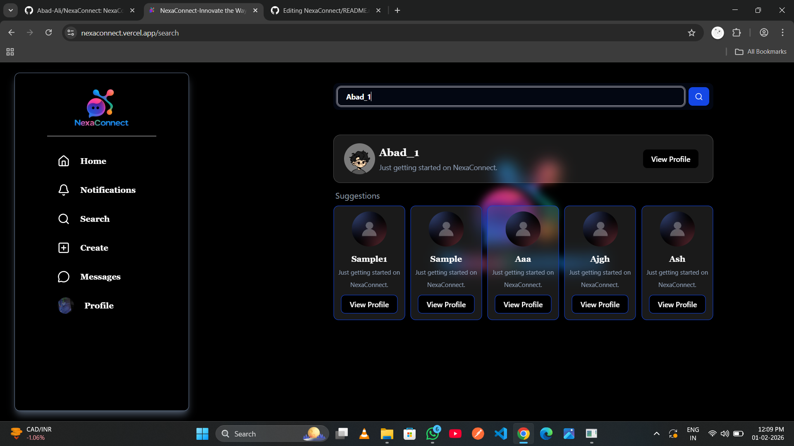
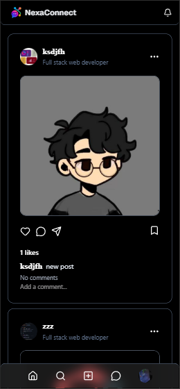
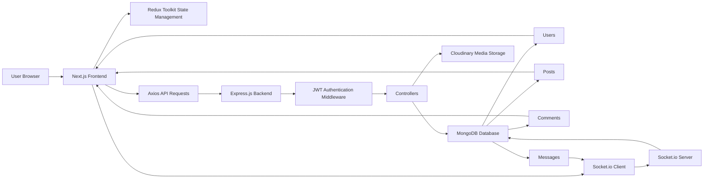
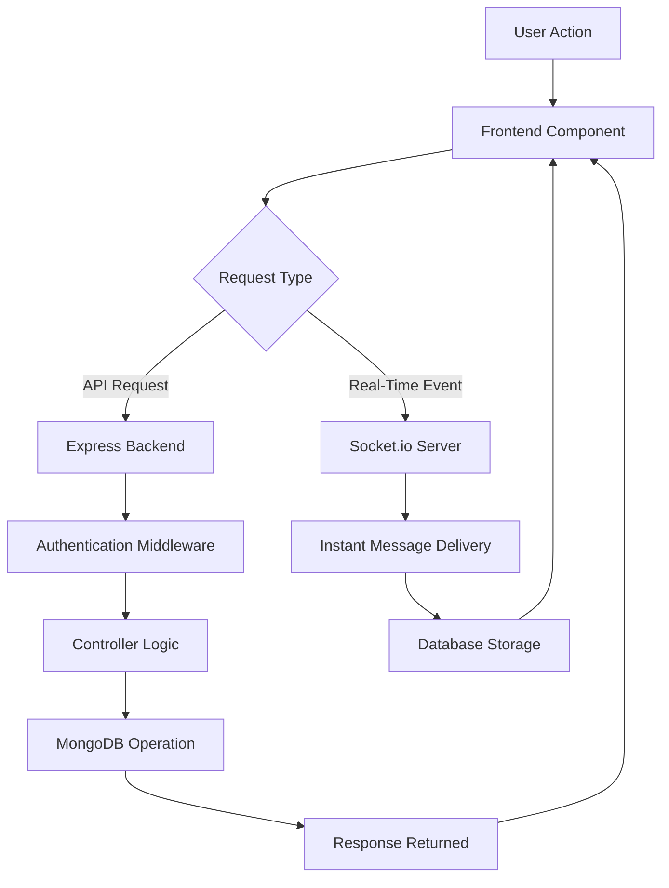

# NexaConnect

<p align="center">
  
</p>

<h1 align="center">NexaConnect</h1>

<p align="center">
A modern full-stack social media platform where users can connect, share posts, interact with others, and communicate through real-time messaging.
</p>

<p align="center">


<a href="https://nexaconnect.vercel.app">
  
</a>

</p>

---

# About The Project

NexaConnect is a full-stack social media web application designed to provide users with a modern platform for sharing content, building connections, and communicating in real time.

The application allows users to create accounts, manage profiles, upload posts, interact through likes and comments, follow other users, and exchange messages instantly.

The project is built using modern web technologies and follows a scalable client-server architecture.

The main goals of NexaConnect are:

* Secure user authentication
* Social interaction between users
* Real-time communication
* Cloud-based media handling
* Responsive user experience
* Maintainable full-stack architecture

---

# Table of Contents

* [About The Project](#about-the-project)
* [Features](#features)
* [Live Demo](#live-demo)
* [Preview](#preview)
* [Tech Stack](#tech-stack)
* [Architecture](#architecture)
* [Project Structure](#project-structure)
* [Installation & Setup](#installation--setup)
* [Environment Variables](#environment-variables)
* [Available Scripts](#available-scripts)
* [Authentication & Security](#authentication--security)
* [Real-Time Chat System](#real-time-chat-system)
* [Database Models](#database-models)
* [API Overview](#api-overview)
* [Deployment](#deployment)
* [Future Improvements](#future-improvements)
* [Contributing](#contributing)
* [Author](#author)
* [Usage Policy](#usage-policy)

---

# Project Highlights

* Full-stack social media application
* JWT authentication system
* Secure password encryption
* User profile management
* Post creation and management
* Like and comment system
* Follow and follower system
* Real-time messaging with Socket.io
* Cloudinary image storage
* Redux Toolkit state management
* REST API architecture
* Responsive user interface

---

# Features

NexaConnect provides a complete social networking experience with authentication, content sharing, user interaction, and real-time communication features.

---

# Authentication Features

* User registration and login system
* JWT-based authentication
* Secure password hashing using bcrypt.js
* Cookie-based session management
* Protected frontend routes
* Protected backend APIs
* User authorization middleware

---

# User Profile Features

Users can manage and interact with profiles.

Features include:

* Create and update profile information
* Upload profile images
* View user profiles
* View followers and following lists
* Follow and unfollow users
* Explore other users

---

# Post Management Features

Users can create and manage posts.

Supported functionality:

* Create posts with captions
* Upload images with posts
* View posts in feed
* Delete own posts
* Open individual post pages
* Share posts externally

---

# Social Interaction Features

NexaConnect allows users to interact with community content.

Users can:

* Like and unlike posts
* Comment on posts
* View comments
* Interact with other users' content
* Build social connections

---

# Real-Time Chat Features

The application includes real-time messaging using Socket.io.

Features:

* One-to-one messaging
* Instant message delivery
* Real-time communication
* Conversation management
* Message history storage

---

# Media Management Features

NexaConnect uses Cloudinary for efficient media handling.

Features:

* Image uploads
* Cloud-based image storage
* Image optimization
* Secure media URLs
* Server-side image processing using Sharp

---

# User Interface Features

The frontend provides a modern and responsive experience.

Includes:

* Responsive design
* Mobile-friendly layout
* Modern component-based UI
* Smooth interactions
* Dark and light theme support
* Interactive sliders using Swiper
* Accessible UI components using Radix UI

---

# State Management Features

The application manages global states using Redux Toolkit.

Handled states include:

* Authentication state
* User information
* Posts data
* Chat messages
* Real-time events
* Socket connections

---

# Technical Highlights

NexaConnect demonstrates:

* Full-stack development workflow
* REST API design
* Real-time application development
* Database relationship management
* Secure authentication practices
* Cloud media integration
* Modern frontend architecture

---

# Live Demo

<p align="center">
  <a href="https://nexaconnect.vercel.app">
    
  </a>

  <a href="https://github.com/Abad-Ali/NexaConnect">
    
  </a>

  <a href="https://www.linkedin.com/in/abadali-dev">
    
  </a>
</p>

---


# Preview

> Screenshots of **NexaConnect**

<details>

<summary><b>Click to view screenshots</b></summary>

<br>

<div align="center">



<h3>Signup Page</h3>

<br/><br/>



<h3>Login Page</h3>

<br/><br/>



<h3>Home Feed</h3>

<br/><br/>



<h3>Real-Time Chat</h3>

<br/><br/>



<h3>User Search</h3>

<br/><br/>



<h3>Responsive Mobile View</h3>

</div>

</details>

---

# Tech Stack

NexaConnect is built using modern full-stack technologies to provide a scalable, secure, and responsive social media experience.

---

# Frontend Technologies

The frontend is developed using Next.js with a component-based architecture.

## Framework

| Technology | Purpose                                  |
| ---------- | ---------------------------------------- |
| Next.js    | React framework for frontend development |
| React.js   | Building reusable UI components          |
| JavaScript | Application logic                        |

---

## Styling & UI

| Technology   | Purpose                           |
| ------------ | --------------------------------- |
| Tailwind CSS | Utility-first styling framework   |
| Radix UI     | Accessible UI components          |
| Swiper       | Interactive sliders and carousels |
| React Icons  | Icon library                      |
| Next Themes  | Theme management                  |

---

## State Management & Data Handling

| Technology       | Purpose                          |
| ---------------- | -------------------------------- |
| Redux Toolkit    | Global state management          |
| React Redux      | Connecting Redux with React      |
| Axios            | API communication                |
| Socket.io Client | Real-time frontend communication |

---

# Backend Technologies

The backend provides REST APIs, authentication, database operations, and real-time communication.

## Runtime & Framework

| Technology | Purpose                    |
| ---------- | -------------------------- |
| Node.js    | Backend JavaScript runtime |
| Express.js | REST API framework         |

---

## Database

| Technology | Purpose                 |
| ---------- | ----------------------- |
| MongoDB    | NoSQL database          |
| Mongoose   | MongoDB object modeling |

---

## Authentication & Security

| Technology    | Purpose                         |
| ------------- | ------------------------------- |
| JWT           | Secure authentication tokens    |
| bcrypt.js     | Password hashing                |
| Cookie Parser | Cookie handling                 |
| CORS          | Cross-origin request management |

---

## Media Handling

| Technology | Purpose                           |
| ---------- | --------------------------------- |
| Cloudinary | Cloud image storage               |
| Multer     | File upload handling              |
| Sharp      | Image processing and optimization |

---

## Real-Time Communication

| Technology | Purpose                               |
| ---------- | ------------------------------------- |
| Socket.io  | Real-time bidirectional communication |

---

# Development Tools

| Tool   | Purpose             |
| ------ | ------------------- |
| Git    | Version control     |
| GitHub | Source code hosting |
| npm    | Package management  |
| Vercel | Frontend deployment |

---

# Technology Overview

```text
Frontend
    |
    |-- Next.js
    |-- React
    |-- Redux Toolkit
    |-- Tailwind CSS
    |
    |
Backend
    |
    |-- Node.js
    |-- Express.js
    |-- Socket.io
    |
    |
Database
    |
    |-- MongoDB
    |-- Mongoose
    |
    |
External Services
    |
    |-- Cloudinary
```

---

The combination of these technologies allows NexaConnect to deliver a modern full-stack application with secure authentication, real-time communication, and efficient media management.

---

# Architecture

NexaConnect follows a full-stack client-server architecture where the frontend, backend, database, and external services communicate together to provide a complete social networking platform.

The architecture is designed with clear separation of responsibilities between different layers:

- Client Layer
- Application Layer
- Data Layer
- External Services Layer

This structure improves scalability, maintainability, security, and allows future feature expansion.

---

# Architecture Diagram



---

# Architecture Components

| Layer | Technology | Responsibility |
|------|------------|----------------|
| Client Layer | Next.js + React | Provides user interface and handles user interactions |
| State Management Layer | Redux Toolkit | Manages global application state |
| Communication Layer | Axios + Socket.io | Handles API requests and real-time communication |
| Backend Layer | Node.js + Express.js | Handles business logic and server operations |
| Security Layer | JWT + Middleware | Provides authentication and route protection |
| Database Layer | MongoDB + Mongoose | Stores application data |
| Media Layer | Cloudinary | Stores and manages uploaded images |

---

# Frontend Layer

The frontend is responsible for creating the user interface, managing application state, and communicating with backend services.

## Responsibilities

- Rendering pages and reusable components
- Managing application state
- Handling user interactions
- Communicating with backend APIs
- Managing real-time socket connections
- Protecting frontend routes

## Technologies Used

- Next.js App Router
- React Components
- Redux Toolkit
- Tailwind CSS
- Socket.io Client

---

# Backend Layer

The backend manages business logic, authentication, database operations, and real-time communication.

## Responsibilities

- User authentication
- Authorization checks
- API request handling
- User management
- Post management
- Comment management
- Message handling
- Database operations
- Media upload processing

## Technologies Used

- Node.js
- Express.js
- MongoDB
- Mongoose
- Socket.io

---

# Data & Service Layer

The data layer manages application information and external resources.

## MongoDB Database

MongoDB stores:

- User accounts
- Profile information
- Posts
- Comments
- Conversations
- Messages
- Social relationships

---

## Cloudinary Media Storage

Cloudinary handles:

- Profile image storage
- Post image storage
- Media optimization
- Secure media URLs

---

# Application Flow

A typical user request follows this flow:



---

# Real-Time Communication Architecture

Socket.io enables instant communication between connected users.

```text
Sender

 |

 |

Socket.io Client

 |

 |

Socket.io Server

 |

 |

Receiver
```

The real-time system is used for:

- Instant messaging
- Live communication
- Real-time updates

---

# Architecture Benefits

This architecture provides:

- Clear separation of responsibilities
- Better maintainability
- Easier debugging
- Independent frontend and backend scaling
- Secure data handling
- Real-time communication support
- Future feature expansion

---

NexaConnect follows a scalable architecture similar to modern production-level full-stack applications, separating responsibilities between different layers while maintaining efficient communication between all services.

---

# Project Structure

NexaConnect follows a structured full-stack project organization with separate frontend and backend directories.

The separation allows independent development, testing, and deployment of both applications.

```text
NexaConnect
│
├── backend
│   │
│   ├── controllers
│   │   ├── message.controller.js
│   │   ├── post.controller.js
│   │   └── user.controller.js
│   │
│   ├── middlewares
│   │   ├── isAuthenticated.js
│   │   └── multer.js
│   │
│   ├── models
│   │   ├── comment.model.js
│   │   ├── conversation.model.js
│   │   ├── message.model.js
│   │   ├── post.model.js
│   │   └── user.model.js
│   │
│   ├── routers
│   │   ├── messages.router.js
│   │   ├── post.router.js
│   │   └── user.route.js
│   │
│   ├── socket
│   │   └── socket.js
│   │
│   ├── utils
│   │   └── index.js
│   │
│   ├── .env
│   ├── package.json
│   └── package-lock.json
│
│
├── frontend
│   │
│   ├── app
│   │   ├── account
│   │   │   └── edit
│   │   │       └── page.js
│   │   │
│   │   ├── chat
│   │   │   ├── [userId]
│   │   │   │   └── page.js
│   │   │   └── page.js
│   │   │
│   │   ├── followersorfollowing
│   │   │   └── [id]
│   │   │       └── page.js
│   │   │
│   │   ├── login
│   │   │   └── page.js
│   │   │
│   │   ├── post
│   │   │   └── [id]
│   │   │       └── page.js
│   │   │
│   │   ├── profile
│   │   │   └── [id]
│   │   │       └── page.js
│   │   │
│   │   ├── search
│   │   │   └── page.js
│   │   │
│   │   ├── signup
│   │   │   └── page.js
│   │   │
│   │   ├── SocketIOProvider.js
│   │   ├── globals.css
│   │   ├── layout.js
│   │   ├── page.js
│   │   └── provider.js
│   │
│   ├── components
│   │   └── ui
│   │       ├── AuthGuard.js
│   │       ├── CarouselSuggestedUser.jsx
│   │       ├── Comment.jsx
│   │       ├── CommentDialog.jsx
│   │       ├── CreatePost.jsx
│   │       ├── Feed.jsx
│   │       ├── Header.jsx
│   │       ├── LeftSideBar.jsx
│   │       ├── Messages.jsx
│   │       ├── Post.jsx
│   │       ├── Posts.jsx
│   │       ├── RightSideBar.jsx
│   │       ├── SinglePost.jsx
│   │       └── SuggestedUsers.jsx
│   │
│   ├── hooks
│   │   ├── useGetAllMessage.jsx
│   │   ├── useGetAllPosts.jsx
│   │   ├── useGetRTM.jsx
│   │   ├── useGetSuggestedUsers.jsx
│   │   └── useGetUserProfile.jsx
│   │
│   ├── lib
│   │   ├── follow.js
│   │   └── utils.js
│   │
│   ├── public
│   │   ├── NexaConnect.png
│   │   ├── bg.png
│   │   ├── default_pic.jpg
│   │   └── assets
│   │
│   ├── redux
│   │   ├── authSlice.js
│   │   ├── chatSlice.js
│   │   ├── postSlice.js
│   │   ├── rtnSlice.js
│   │   ├── socketSlice.js
│   │   └── store.js
│   │
│   ├── package.json
│   ├── next.config.mjs
│   └── package-lock.json
│
├── screenshots
│
└── README.md
```

---

# Backend Directory Explanation

| Folder      | Purpose                                    |
| ----------- | ------------------------------------------ |
| controllers | Contains application business logic        |
| models      | Defines MongoDB database schemas           |
| routers     | Defines API endpoints                      |
| middlewares | Handles authentication and file processing |
| socket      | Handles real-time communication            |
| utils       | Contains reusable backend utilities        |

---

# Frontend Directory Explanation

| Folder     | Purpose                             |
| ---------- | ----------------------------------- |
| app        | Contains Next.js application routes |
| components | Reusable React components           |
| hooks      | Custom React hooks                  |
| redux      | Global state management             |
| lib        | Helper functions and utilities      |
| public     | Static assets and images            |

---

# Project Organization Benefits

This structure provides:

* Clean separation of frontend and backend
* Reusable components
* Maintainable codebase
* Easy feature expansion
* Better development workflow

---

# Installation & Setup

Follow the steps below to set up NexaConnect locally for development.

---

# Prerequisites

Before installing NexaConnect, make sure the following tools are installed:

| Requirement | Version                             |
| ----------- | ----------------------------------- |
| Node.js     | 18 or higher                        |
| npm         | Latest version                      |
| MongoDB     | Local installation or MongoDB Atlas |
| Git         | Latest version                      |

---

# Clone Repository

Clone the project repository:

```bash
git clone https://github.com/your-username/NexaConnect.git
```

Navigate into the project directory:

```bash
cd NexaConnect
```

---

# Backend Setup

Navigate to the backend folder:

```bash
cd backend
```

Install backend dependencies:

```bash
npm install
```

Create a `.env` file inside the backend directory.

Example:

```env
PORT=5000

MONGO_URI=your_mongodb_connection_string

JWT_SECRET=your_jwt_secret

CLOUDINARY_CLOUD_NAME=your_cloudinary_cloud_name

CLOUDINARY_API_KEY=your_cloudinary_api_key

CLOUDINARY_API_SECRET=your_cloudinary_api_secret

CLIENT_URL=http://localhost:3000
```

Start the backend server:

```bash
npm run dev
```

Backend will start on:

```text
http://localhost:5000
```

---

# Frontend Setup

Open another terminal and navigate to the frontend folder:

```bash
cd frontend
```

Install frontend dependencies:

```bash
npm install
```

Create a `.env.local` file inside the frontend directory.

Example:

```env
NEXT_PUBLIC_API_URL=http://localhost:5000
NEXT_PUBLIC_SOCKET_URL=http://localhost:5000
```

Start the frontend development server:

```bash
npm run dev
```

Frontend will start on:

```text
http://localhost:3000
```

---

# Running the Application

After completing the setup:

1. Start the backend server

```bash
cd backend
npm run dev
```

2. Start the frontend server

```bash
cd frontend
npm run dev
```

3. Open the application:

```text
http://localhost:3000
```

---

# Development Workflow

During development:

```text
Frontend
   |
   |
Next.js Development Server
   |
   |
REST API / Socket.io
   |
   |
Express Backend
   |
   |
MongoDB Database
```

---

# Troubleshooting

## Backend Connection Error

Check:

* MongoDB connection string
* Environment variables
* Database availability
* Backend server status

---

## Frontend API Error

Check:

* Backend URL configuration
* CORS settings
* Environment variables
* Backend availability

---

## Image Upload Error

Check:

* Cloudinary credentials
* File upload configuration
* Cloudinary account status

---

After completing these steps, NexaConnect will be ready for local development.

---

# Environment Variables

NexaConnect uses environment variables to securely store sensitive configuration values such as database credentials, authentication secrets, and external service keys.

Do not commit `.env` files to GitHub because they contain private information.

---

# Backend Environment Variables

Create a `.env` file inside the `backend` directory.

Location:

```text id="m7r3kq"
backend/.env
```

Example configuration:

```env id="7e2r6h"
PORT=5000

MONGO_URI=your_mongodb_connection_string

JWT_SECRET=your_secret_key

CLOUDINARY_CLOUD_NAME=your_cloudinary_cloud_name

CLOUDINARY_API_KEY=your_cloudinary_api_key

CLOUDINARY_API_SECRET=your_cloudinary_api_secret

CLIENT_URL=http://localhost:3000
```

---

# Backend Variables Explanation

| Variable              | Description                            |
| --------------------- | -------------------------------------- |
| PORT                  | Backend server port                    |
| MONGO_URI             | MongoDB database connection URL        |
| JWT_SECRET            | Secret key used for JWT authentication |
| CLOUDINARY_CLOUD_NAME | Cloudinary cloud identifier            |
| CLOUDINARY_API_KEY    | Cloudinary API access key              |
| CLOUDINARY_API_SECRET | Cloudinary private API secret          |
| CLIENT_URL            | Frontend application URL               |

---

# Frontend Environment Variables

Create a `.env.local` file inside the `frontend` directory.

Location:

```text id="x4n2pz"
frontend/.env.local
```

Example configuration:

```env id="2f8zqk"
NEXT_PUBLIC_API_URL=http://localhost:5000

NEXT_PUBLIC_SOCKET_URL=http://localhost:5000
```

---

# Frontend Variables Explanation

| Variable               | Description          |
| ---------------------- | -------------------- |
| NEXT_PUBLIC_API_URL    | Backend API URL      |
| NEXT_PUBLIC_SOCKET_URL | Socket.io server URL |

---

# Environment File Security

For security purposes:

* Never upload `.env` files to GitHub
* Never share API keys publicly
* Use different keys for development and production
* Rotate exposed credentials immediately
* Store production secrets securely

---

# Recommended `.gitignore` Entries

Make sure the following files are ignored:

```gitignore id="l8o4vz"
.env

.env.local

node_modules

.next

dist
```

---

Proper environment configuration ensures that NexaConnect can run securely across development, testing, and production environments.

---

# Available Scripts

NexaConnect provides different npm scripts for running, developing, and building the frontend and backend applications.

---

# Backend Scripts

Navigate to the backend directory:

```bash
cd backend
```

Install dependencies:

```bash
npm install
```

Available commands:

| Command       | Description                                   |
| ------------- | --------------------------------------------- |
| `npm start`   | Starts the backend server                     |
| `npm run dev` | Starts the backend server in development mode |

Example:

```bash
npm run dev
```

Backend server runs on:

```text
http://localhost:5000
```

---

# Frontend Scripts

Navigate to the frontend directory:

```bash
cd frontend
```

Install dependencies:

```bash
npm install
```

Available commands:

| Command         | Description                       |
| --------------- | --------------------------------- |
| `npm run dev`   | Starts Next.js development server |
| `npm run build` | Creates production build          |
| `npm start`     | Runs production server            |
| `npm run lint`  | Checks code quality using ESLint  |

Example:

```bash
npm run dev
```

Frontend application runs on:

```text
http://localhost:3000
```

---

# Production Build

To create an optimized production build:

Frontend:

```bash
npm run build
```

After a successful build:

```bash
npm start
```

---

# Development Workflow

Recommended development process:

```text
Install Dependencies

        |

        |

Configure Environment Variables

        |

        |

Start Backend Server

        |

        |

Start Frontend Server

        |

        |

Develop and Test Features

        |

        |

Create Production Build
```

---

# Code Quality

NexaConnect uses ESLint to maintain frontend code quality.

Run:

```bash
npm run lint
```

This helps identify:

* Syntax errors
* Code style issues
* Unused variables
* Potential problems

---

Using these scripts, developers can easily manage development and production workflows for NexaConnect.

---

# Authentication & Security

NexaConnect implements a secure authentication system to protect user accounts, application resources, and private user data.

The authentication architecture uses JWT-based authorization, password encryption, protected routes, and middleware-based security checks.

---

# Authentication Technologies

| Technology           | Purpose                               |
| -------------------- | ------------------------------------- |
| JWT (JSON Web Token) | User authentication and authorization |
| bcrypt.js            | Secure password hashing               |
| Cookies              | Secure token storage                  |
| Middleware           | Protecting private routes             |
| Mongoose             | Secure database interaction           |

---

# Authentication Flow

```text id="f9k3pd"
User Registration

        |

        |

Validate User Data

        |

        |

Hash Password Using bcrypt

        |

        |

Store User In MongoDB

        |

        |

User Login

        |

        |

Verify Credentials

        |

        |

Generate JWT Token

        |

        |

Store Authentication Cookie

        |

        |

Access Protected Resources
```

---

# User Registration

During registration:

1. User provides account information
2. Backend validates the received data
3. Password is encrypted using bcrypt.js
4. User information is stored in MongoDB
5. Account is created successfully

---

# User Login

During login:

1. User submits email and password
2. Backend searches for the user
3. Password is compared securely
4. JWT token is generated
5. Authentication session is created
6. User receives access to protected features

---

# Authorization System

NexaConnect uses authorization checks to ensure users can access only permitted resources.

Protected actions include:

* Creating posts
* Updating profiles
* Deleting posts
* Liking posts
* Commenting
* Following users
* Sending messages

---

# Backend Security

The backend uses:

* Authentication middleware
* JWT verification
* Input validation
* Error handling
* Secure password storage
* Protected API routes

Example flow:

```text id="3r9f5q"
Client Request

      |

      |

Authentication Middleware

      |

      |

JWT Verification

      |

      |

Controller Execution

      |

      |

Database Operation
```

---

# Frontend Security

Frontend protection includes:

* Protected pages
* Authentication state management
* Route validation
* Secure API communication

Users without valid authentication are redirected away from protected pages.

---

# Security Best Practices

NexaConnect follows these practices:

* Passwords are never stored in plain text
* Sensitive keys are stored in environment variables
* API access is controlled through authentication
* Database credentials are protected
* User permissions are verified before actions

---

The authentication and security architecture provides a reliable foundation for protecting user information while maintaining a smooth user experience.

----

# Real-Time Chat System

NexaConnect includes a real-time messaging system that allows users to communicate instantly without refreshing the application.

The chat system is built using Socket.io for real-time bidirectional communication between users.

---

# Chat Architecture

```text id="m8u6q2"
Sender User

      |

      |

Socket.io Client

      |

      |

Socket.io Server

      |

      |

Receiver User

      |

      |

Message Stored In MongoDB
```

---

# Technologies Used

| Technology    | Purpose                        |
| ------------- | ------------------------------ |
| Socket.io     | Real-time communication        |
| Node.js       | Server runtime                 |
| Express.js    | Backend API handling           |
| MongoDB       | Message storage                |
| Redux Toolkit | Frontend chat state management |

---

# Chat Features

The messaging system supports:

* Real-time one-to-one messaging
* Instant message delivery
* Conversation management
* Message history
* User-based conversations
* Persistent message storage

---

# Message Flow

When a user sends a message:

```text id="7h2s6a"
User Types Message

        |

        |

Frontend Sends Socket Event

        |

        |

Socket.io Server Receives Event

        |

        |

Message Delivered To Receiver

        |

        |

Message Saved In MongoDB

        |

        |

Chat Updated In Real Time
```

---

# Socket.io Implementation

The socket connection handles:

* User connection tracking
* Message events
* Real-time updates
* Client-server communication

Example events:

```text id="4l8y1s"
connect

disconnect

sendMessage

receiveMessage
```

---

# Chat Data Flow

```text id="v4z0hp"
Frontend Chat Component

          |

          |

Socket.io Client

          |

          |

Backend Socket Server

          |

          |

Message Controller

          |

          |

Message Model

          |

          |

MongoDB Database
```

---

# Message Storage

Messages are stored with important information:

| Field          | Description                   |
| -------------- | ----------------------------- |
| senderId       | User who sent the message     |
| receiverId     | User who receives the message |
| message        | Message content               |
| conversationId | Related conversation          |
| createdAt      | Message timestamp             |

---

# Benefits of Real-Time Messaging

The chat system provides:

* Fast communication
* Better user engagement
* Instant updates
* Scalable communication architecture
* Improved social interaction

---

The Socket.io-based messaging system makes NexaConnect a complete social platform by adding live communication capabilities alongside content sharing features.

---

# Database Models

NexaConnect uses MongoDB as the primary database with Mongoose as the Object Data Modeling (ODM) library.

The database structure is designed to efficiently manage users, posts, comments, conversations, and messages while maintaining clear relationships between different collections.

---

# Database Overview

```text
MongoDB Database

│
├── Users
│
├── Posts
│
├── Comments
│
├── Conversations
│
└── Messages
```

---

# User Model

The User model stores user account information, profile details, and social relationships.

## User Collection

```javascript
{
    username,
    email,
    password,
    profilePicture,
    bio,
    followers,
    following,
    bookmarks,
    createdAt,
    updatedAt
}
```

## User Model Responsibilities

The User model manages:

- User registration information
- Authentication data
- Profile details
- Followers and following relationships
- User activity information

---

# Post Model

The Post model stores content created by users.

## Post Collection

```javascript
{
    caption,
    image,
    author,
    likes,
    comments,
    createdAt,
    updatedAt
}
```

## Post Model Responsibilities

The Post model manages:

- User-created posts
- Post captions
- Uploaded images
- Like relationships
- Comment relationships
- Post ownership

---

# Comment Model

The Comment model stores comments made by users on posts.

## Comment Collection

```javascript
{
    text,
    author,
    post,
    createdAt,
    updatedAt
}
```

## Comment Model Responsibilities

The Comment model manages:

- Comment content
- Comment author
- Related post information
- User interactions

---

# Conversation Model

The Conversation model manages chat relationships between users.

## Conversation Collection

```javascript
{
    participants,
    messages,
    createdAt,
    updatedAt
}
```

## Conversation Model Responsibilities

The Conversation model manages:

- Chat participants
- Conversation history
- Message grouping
- User communication relationships

---

# Message Model

The Message model stores individual chat messages between users.

## Message Collection

```javascript
{
    senderId,
    receiverId,
    message,
    conversationId,
    createdAt,
    updatedAt
}
```

## Message Model Responsibilities

The Message model manages:

- Message content
- Sender information
- Receiver information
- Conversation relationships
- Message timestamps

---

# Database Relationships

NexaConnect uses references between collections to maintain relationships between users and application data.

```text
User

 |

 | creates

 |

Posts

 |

 | contains

 |

Comments


User

 |

 | communicates through

 |

Conversations

 |

 |

Messages
```

---

# Database Design Benefits

The database design provides:

- Organized data structure
- Efficient data retrieval
- Clear relationships between collections
- Easy database maintenance
- Better scalability for future features

---

NexaConnect uses a structured MongoDB schema design that allows efficient management of social networking features while keeping the application flexible for future improvements.

---

# API Overview

NexaConnect uses a RESTful API architecture to handle communication between the frontend application and backend server.

The API layer manages authentication, users, posts, social interactions, media operations, and messaging functionality.

---

# API Base URL

Development:

```text
http://localhost:5000
```

Production:

```text
Your deployed backend URL
```

---

# API Architecture

```text id="3k9x2v"
Frontend Application

        |

        |

HTTP Requests / Socket Events

        |

        |

Express.js REST API

        |

        |

Controllers

        |

        |

MongoDB Database
```

---

# User APIs

User-related APIs handle authentication and profile operations.

| Method | Endpoint                      | Description             |
| ------ | ----------------------------- | ----------------------- |
| POST   | `/api/v1/user/register`       | Register a new user     |
| POST   | `/api/v1/user/login`          | Login user              |
| GET    | `/api/v1/user/logout`         | Logout user             |
| GET    | `/api/v1/user/profile/:id`    | Get user profile        |
| PUT    | `/api/v1/user/profile/update` | Update user profile     |
| GET    | `/api/v1/user/suggested`      | Get suggested users     |
| POST   | `/api/v1/user/follow/:id`     | Follow or unfollow user |

---

# Post APIs

Post APIs manage content creation and interactions.

| Method | Endpoint                    | Description           |
| ------ | --------------------------- | --------------------- |
| POST   | `/api/v1/post/create`       | Create a new post     |
| GET    | `/api/v1/post/all`          | Get all posts         |
| GET    | `/api/v1/post/:id`          | Get a single post     |
| DELETE | `/api/v1/post/delete/:id`   | Delete a post         |
| POST   | `/api/v1/post/:id/like`     | Like or unlike a post |
| POST   | `/api/v1/post/:id/comment`  | Add comment           |
| GET    | `/api/v1/post/:id/comments` | Get post comments     |

---

# Message APIs

Message APIs handle user conversations and communication.

| Method | Endpoint                   | Description               |
| ------ | -------------------------- | ------------------------- |
| POST   | `/api/v1/message/send/:id` | Send message              |
| GET    | `/api/v1/message/all/:id`  | Get conversation messages |

---

# Authentication Requirements

Protected APIs require user authentication.

Authentication is handled using:

* JWT tokens
* Secure cookies
* Authentication middleware

Protected operations include:

* Creating posts
* Updating profiles
* Deleting content
* Liking posts
* Commenting
* Following users
* Sending messages

---

# API Request Flow

```text id="n7r5yx"
User Action

      |

      |

Frontend Component

      |

      |

Axios Request

      |

      |

Express Route

      |

      |

Authentication Middleware

      |

      |

Controller

      |

      |

Database Operation

      |

      |

Response Returned
```

---

# API Response Format

API responses follow a structured JSON format.

Example:

```json
{
    "success": true,
    "message": "Operation completed successfully",
    "data": {}
}
```

---

# Error Handling

The API handles errors using:

* Input validation
* Authentication checks
* Database error handling
* HTTP status codes
* Meaningful error messages

---

The REST API architecture keeps frontend and backend communication organized, secure, and scalable.

---

# Deployment

NexaConnect follows a modern deployment architecture where the frontend and backend applications are deployed separately.

This approach improves scalability, maintenance, and allows each service to be managed independently.

---

# Deployment Architecture

```text id="r9m4vx"
                    Users

                      |

                      |

              Frontend Application

                  Next.js

                      |

                      |

              Backend Application

              Node.js + Express

                      |

          ----------------------------

          |                          |

      MongoDB                  Cloudinary

     Database              Media Storage
```

---

# Frontend Deployment

The frontend application is built using Next.js and can be deployed on platforms such as Vercel.

Frontend deployment includes:

* Production Next.js build
* Environment variable configuration
* API URL configuration
* Static asset optimization
* Responsive application delivery

---

# Frontend Build Process

Navigate to the frontend directory:

```bash id="5m8qkd"
cd frontend
```

Install dependencies:

```bash id="q0w6ja"
npm install
```

Create production build:

```bash id="d4v8xn"
npm run build
```

Start production server:

```bash id="4f9pza"
npm start
```

---

# Backend Deployment

The backend can be deployed on any Node.js compatible hosting platform.

Supported platforms include:

* Render
* Railway
* AWS
* DigitalOcean
* Other Node.js hosting providers

Backend deployment requires:

* Node.js runtime
* Environment variables
* MongoDB connection
* Cloudinary configuration
* CORS configuration

---

# Backend Production Configuration

Required environment variables:

```env id="9q7b2w"
PORT=5000

MONGO_URI=production_database_url

JWT_SECRET=production_secret

CLOUDINARY_CLOUD_NAME=cloud_name

CLOUDINARY_API_KEY=api_key

CLOUDINARY_API_SECRET=api_secret

CLIENT_URL=frontend_domain
```

---

# Database Deployment

NexaConnect uses MongoDB for production data storage.

Database setup includes:

* Creating MongoDB cluster
* Configuring database access
* Adding connection string
* Securing database credentials
* Connecting backend services

---

# Media Storage Deployment

Cloudinary manages uploaded images and media files.

Media flow:

```text id="k2h8qf"
User Upload

      |

      |

Backend Processing

      |

      |

Cloudinary Storage

      |

      |

Image URL Stored In Database
```

---

# Production Checklist

Before deploying NexaConnect:

* Configure production environment variables
* Update frontend API URL
* Configure backend CORS settings
* Connect production database
* Configure Cloudinary credentials
* Test authentication system
* Test post functionality
* Test real-time messaging

---

# Deployment Benefits

This deployment strategy provides:

* Independent scaling
* Better performance management
* Easier maintenance
* Secure configuration handling
* Production-ready architecture

---

NexaConnect uses a deployment structure similar to modern full-stack applications, allowing each service to be maintained and scaled independently.

---

# Future Improvements

NexaConnect currently provides core social networking features including authentication, posts, user interactions, and real-time messaging.

The following improvements can be added in future versions to enhance functionality, scalability, and user experience.

---

# Communication Improvements

Future messaging enhancements:

* Group chat support
* Message reactions
* Message read receipts
* Typing indicators
* Online/offline user status
* Voice calling
* Video calling
* Push notifications

---

# Content Improvements

Future content-related features:

* Video post support
* Stories feature
* Post sharing system
* Save/bookmark posts
* Hashtag support
* Trending posts
* Advanced post search
* Content recommendation system

---

# User Experience Improvements

Planned UI and UX improvements:

* Advanced profile customization
* Improved notification system
* Better search experience
* Personalized user feed
* More interactive animations
* Enhanced accessibility support
* Improved mobile experience

---

# Security Improvements

Future security enhancements:

* Email verification
* Password reset functionality
* Two-factor authentication
* Login activity tracking
* Device management
* Advanced permission controls

---

# Performance Improvements

Possible technical improvements:

* Database indexing optimization
* Advanced caching strategies
* API performance optimization
* Image loading optimization
* Server monitoring
* Better error tracking

---

# Mobile Application

Future expansion possibilities:

* Android application
* iOS application
* Mobile-specific interface
* Mobile push notifications
* Offline support

---

# Advanced Platform Features

Future possibilities:

* Community groups
* Creator profiles
* Analytics dashboard
* Content moderation tools
* AI-based recommendations
* Advanced search system

---

# Infrastructure Improvements

Future technical upgrades:

* Docker containerization
* CI/CD pipeline
* Automated testing
* Cloud monitoring
* Load balancing
* Scalable backend architecture

---

These improvements can help NexaConnect evolve into a more complete and scalable social networking platform while maintaining a strong technical foundation.

---

# Contributing

Contributions are welcome for improving NexaConnect.

If you want to suggest improvements, fix issues, or add new functionality, you can follow the contribution process below.

---

# Contribution Guidelines

Before contributing:

* Follow the existing project structure
* Write clean and readable code
* Maintain consistent coding style
* Test changes before submitting
* Avoid breaking existing features
* Update documentation when required

---

# Contribution Workflow

## 1. Fork the Repository

Create your own fork of the NexaConnect repository.

---

## 2. Clone the Repository

Clone your fork locally:

```bash id="7d8j2m"
git clone https://github.com/your-username/NexaConnect.git
```

Move into the project directory:

```bash id="v2x8kf"
cd NexaConnect
```

---

## 3. Create a New Branch

Create a separate branch for your changes:

```bash id="h6k3pz"
git checkout -b feature/new-feature
```

Example:

```bash id="n4q8sd"
git checkout -b feature/notifications
```

---

## 4. Make Changes

You can contribute by:

* Adding new features
* Fixing bugs
* Improving UI
* Optimizing performance
* Improving documentation
* Enhancing security

---

## 5. Test Your Changes

Before submitting:

* Run the application locally
* Check existing functionality
* Test new features
* Verify there are no errors

---

## 6. Commit Changes

Create a meaningful commit:

```bash id="m5r7xw"
git add .

git commit -m "Add new feature"
```

---

## 7. Push Changes

Push your branch:

```bash id="x9q4vz"
git push origin feature/new-feature
```

---

## 8. Create Pull Request

Submit a pull request with:

* Clear description of changes
* Reason for improvement
* Screenshots for UI updates
* Testing details

---

# Contribution Areas

You can contribute to:

* Frontend improvements
* Backend improvements
* New social features
* Performance optimization
* Security enhancements
* Documentation improvements

---

Following these guidelines helps maintain NexaConnect as a clean, stable, and scalable project.

---

# Author

## Abad Ali

Full Stack Developer

Passionate about building modern, scalable, and user-friendly web applications using current technologies.

I enjoy creating full-stack solutions that combine clean user interfaces, secure backend systems, and efficient database architectures.

---

<p align="left">

<a href="https://github.com/Abad-Ali">

</a>

<a href="https://www.linkedin.com/in/abadali-dev">

</a>

<a href="https://abadali.vercel.app">

</a>

<a href="mailto:abadali1707@gmail.com">

</a>

</p>

---

# Usage Policy

This project is created and maintained by **Abad Ali**.

NexaConnect is shared for learning, reference, and development purposes. You are welcome to explore the source code and understand the implementation of the application.

---

# Allowed Usage

You are allowed to:

* Explore the source code
* Learn from the implementation
* Use the project as a reference for educational purposes
* Create improvements through contributions
* Build similar applications while applying your own implementation

---

# Restrictions

You are not allowed to:

* Claim NexaConnect as your own original work
* Copy the complete project and redistribute it under your name
* Remove original author credits
* Use personal branding, logos, images, or content without permission
* Present the project as a commercial product without authorization

---

# Attribution

If you use NexaConnect as inspiration for your own work, proper credit and acknowledgment are appreciated.

You may reference this project as a learning resource while creating your own unique implementation.

---

# Contact

For questions regarding usage, permissions, or collaboration, you can contact the author through the provided social links.

---

Thank you for respecting the work and effort invested in building NexaConnect.

---

# Acknowledgements

Special thanks to the open-source community and all developers who create the tools, libraries, and platforms that make projects like NexaConnect possible.

This project is built using many powerful technologies and open-source resources that help developers create modern, scalable, and user-friendly applications.

---

# Technologies & Libraries

NexaConnect is powered by:

* Next.js
* React
* Tailwind CSS
* Redux Toolkit
* React Redux
* Express.js
* Node.js
* MongoDB
* Mongoose
* Socket.io
* JWT
* bcrypt.js
* Cloudinary
* Multer
* Sharp
* Radix UI
* Swiper
* Axios
* React Icons

---

# Open Source Community

Appreciation to:

* Open-source contributors
* Library maintainers
* Documentation writers
* Developer communities
* Everyone who shares knowledge and resources

Their contributions help developers build better applications and continue improving the web ecosystem.

---

# Final Note

Thank you for checking out **NexaConnect**.

If you find this project useful or interesting:

* Consider starring the repository
* Report issues and improvements
* Share ideas for future features

Your support and feedback are highly appreciated.

---